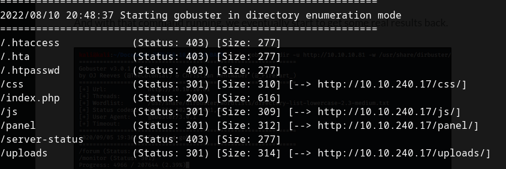

# Tryhackme: RootMe
### https://tryhackme.com/room/rrootme

**rustscan -b --ulimit 5000 -a 10.10.240.17 -r 1-65535 -- -A -sC**

PORT   STATE SERVICE REASON  VERSION
22/tcp open  ssh     syn-ack OpenSSH 7.6p1 Ubuntu 4ubuntu0.3 (Ubuntu Linux; protocol 2.0)
| ssh-hostkey: 
|   2048 4a:b9:16:08:84:c2:54:48:ba:5c:fd:3f:22:5f:22:14 (RSA)
| ssh-rsa AAAAB3NzaC1yc2EAAAADAQABAAABAQC9irIQxn1jiKNjwLFTFBitstKOcP7gYt7HQsk6kyRQJjlkhHYuIaLTtt1adsWWUhAlMGl+97TsNK93DijTFrjzz4iv1Zwpt2hhSPQG0GibavCBf5GVPb6TitSskqpgGmFAcvyEFv6fLBS7jUzbG50PDgXHPNIn2WUoa2tLPSr23Di3QO9miVT3+TqdvMiphYaz0RUAD/QMLdXipATI5DydoXhtymG7Nb11sVmgZ00DPK+XJ7WB++ndNdzLW9525v4wzkr1vsfUo9rTMo6D6ZeUF8MngQQx5u4pA230IIXMXoRMaWoUgCB6GENFUhzNrUfryL02/EMt5pgfj8G7ojx5
|   256 a9:a6:86:e8:ec:96:c3:f0:03:cd:16:d5:49:73:d0:82 (ECDSA)
| ecdsa-sha2-nistp256 AAAAE2VjZHNhLXNoYTItbmlzdHAyNTYAAAAIbmlzdHAyNTYAAABBBERAcu0+Tsp5KwMXdhMWEbPcF5JrZzhDTVERXqFstm7WA/5+6JiNmLNSPrqTuMb2ZpJvtL9MPhhCEDu6KZ7q6rI=
|   256 22:f6:b5:a6:54:d9:78:7c:26:03:5a:95:f3:f9:df:cd (ED25519)
|_ssh-ed25519 AAAAC3NzaC1lZDI1NTE5AAAAIC4fnU3h1O9PseKBbB/6m5x8Bo3cwSPmnfmcWQAVN93J
80/tcp open  http    syn-ack Apache httpd 2.4.29 ((Ubuntu))
| http-cookie-flags: 
|   /: 
|     PHPSESSID: 
|_      httponly flag not set
|_http-title: HackIT - Home
| http-methods: 
|_  Supported Methods: GET HEAD POST OPTIONS
|_http-server-header: Apache/2.4.29 (Ubuntu)
Service Info: OS: Linux; CPE: cpe:/o:linux:linux_kernel

# Reconnaissance
Scan the machine, how many ports are open?
As you can see there are 2 ports open

What version of Apache is running?
2.4.29

What service is running on port 22?
SSH

Find directories on the web server using the GoBuster tool.
gobuster dir -u http://10.10.240.17 -w /usr/share/seclists/Discovery/Web-Content/common.txt 

What is the hidden directory?
/panel

_________________

# Getting a Shell
When we open  http://10.10.240.17/panel, we will see the upload form. Yup, this is upload vulnerability!

![[Pasted image 20220810205504.png]]

You can get php reverseshell from https://github.com/pentestmonkey/php-reverse-shell

![[Pasted image 20220810210200.png]]

If we upload the shell directly, the shell won't be uploaded. 

To bypass it you can rename the extension from.php to anything else for example:
reverse.php to reverse.php16.

Then if we uploaded, success!

![[Pasted image 20220810210511.png]]

Then go to http://10.10.240.17/uploads, set up the listener, open the reverse.php16

But unfortunately the reverseshell won't work!

____

So we will test which extension will work. 
1. Fire up your burpsuite
2. When you upload the file Intercept it with burpsuite and send it to intruder
3. After that Clear the position and add php to position
![[Pasted image 20220810213523.png]]
4. Go to payload and load your extension Fuzzer. I use it from seclists which located in /usr/share/seclists/Fuzzing/extensions-most-common.fuzz.txt
5. Remove unneeded extension
6. Start attack
7. After the attack finished. Go to the result and order the length by descendence 
8. Find the longest length which is phtml (ignore shtml)

![[Pasted image 20220810213305.png]]

_____

Now we know which extension works. After that rename your shell to reverse.phtml and upload it again. Start the listener then open the uploaded file.

____

# We get the shell!
![[Pasted image 20220810214200.png]]

Find a form to upload and get a reverse shell, and find the flag.
user.txt

**find / -name "user.txt"**

it is located on /var/www/

![[Pasted image 20220810214351.png]]

_________

# Privilege Escalation 

Search for files with SUID permission, which file is weird?

find / -perm -4000 2>/dev/null
/usr/bin/python

Find a form to escalate your privileges.
https://gtfobins.github.io/gtfobins/python/#suid

![[Pasted image 20220810215346.png]]

cat /root/root.txt
